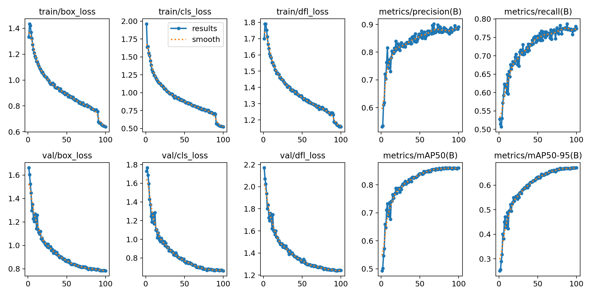
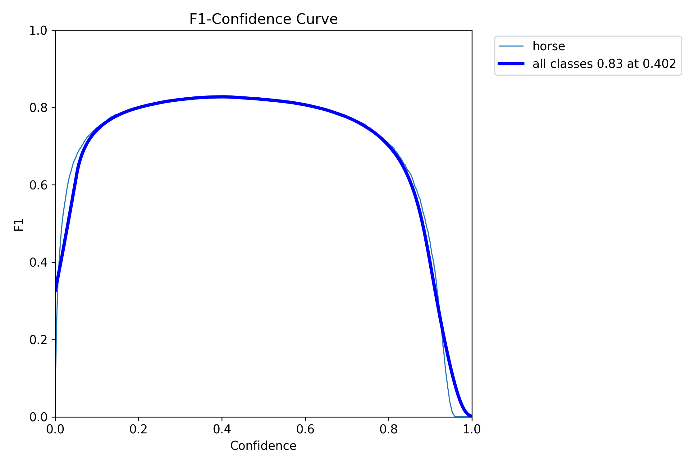
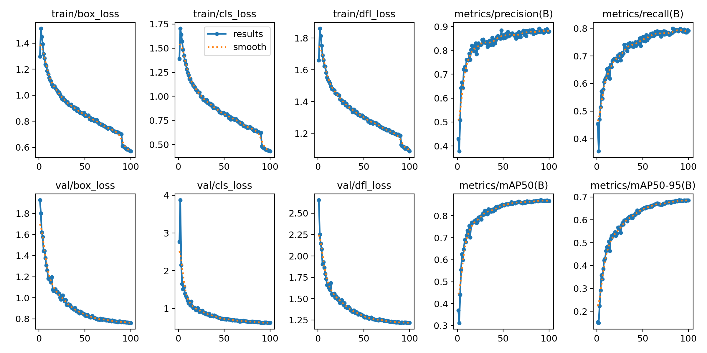
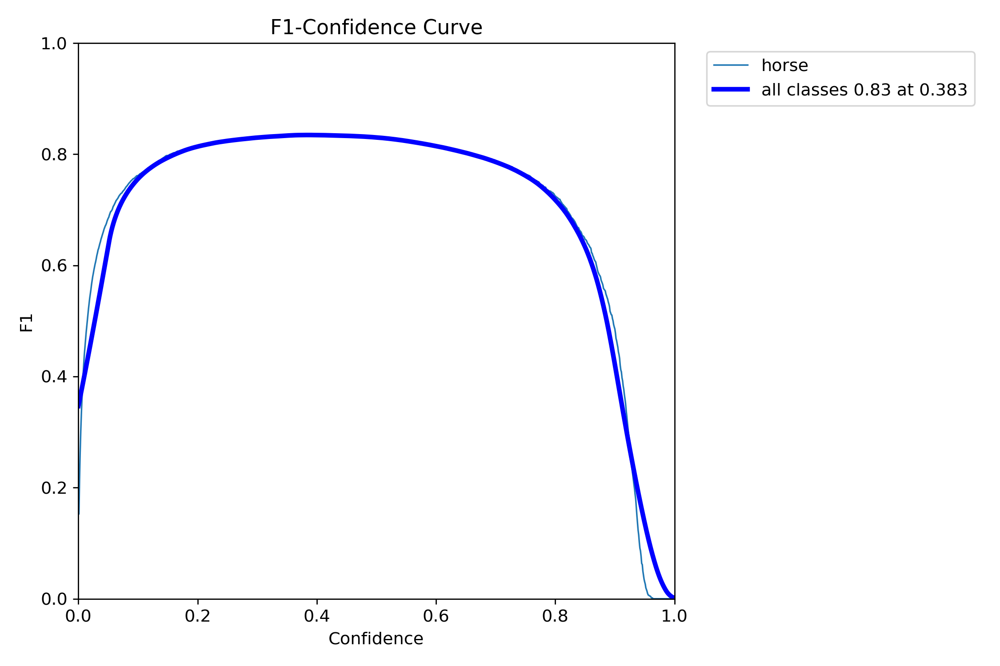

# CV-Model-0
Made by **EzzMahdy** for detection of horse classes.

## Report

first off this was a very entertaining project i really enjoyed i had multiple challenges which were fun to handle i started the project on a dataset of ~800 imgs and trained the yolo11n model on it and finsihed in day2 but when i ran inference on the uneen images i wasnt satisfied of what i got it detected the horses but the bounding boxes were off and there was an image of a man riding a horse it included the man as the horse and that triggered me to increase the dataset at first i wasnt sure about the size of new dataset but i pulled up the courage and uploaded a data set of ~7100 imgs but at that quantity of images i was sure i hade to tune the data set so i applied scripts that filtered out duplicate images then i had to find the sweet spot where the yolo11n would be at peak performance and i realised after thankfully the first attempt it was at 99 epochs as at the hundredth epoch val/box_loss started increasing then after evaluating results i realised that the percision and recall werent very good so i took a look at some of the validation images and i realised that the images had horses far away and the model was struggling at those so i reacted by increasing imgsz to 800 which was last config change that prduced satisfying results for me then i had to make the bonus on kaggle as i was instructed and that was my biggest struggle since i had no prior experience with notebooks before but i handled it and made the yolo11s model on the same config.

i hope i was up to the task at hand hope i didnt overengineer it or messed up in any way.

**thank you <3**

## The data set
A datase that combines multiple datasets from roboflow into one (https://app.roboflow.com/ezz-mahdy/cv-model-0-finaldataset) with 70/20/10 split distribution with a sole class called **horse**.

    

    

## the yolo model 
- i went through a process of selection during the project where i tried two pretrained model
 **yolo11n** (locally) **yolo11s** (on kaggle) but my main model to be prefered is the **yolo11n** mainly as its generally faster and lighter computationally than yolo11s.
- for the training env. there was two; locally on my laptop (documented on the repo)
 , on the kaggle notebook https://www.kaggle.com/code/ezzmahdy1/cv-model-0.
- for the configuration its was: 
    1. epochs=100 (as it turned out and no its not overfitting as the val/box_loss and val/cls_loss is continuously decreasing).
    2. imgsz=800 (as some of the images included horses away from camera so the model had problems with them)
    3. batch=0.6 (locally) and batch=16(on kaggle)

- the final models in .pt can be found in /myFinalModels/x/weights/best.pt

## evaluation scores

    
    main model (yolo11n)

    

    
    

    
    

    
    secondary model (yolo11s)

    

    
    

    
    

